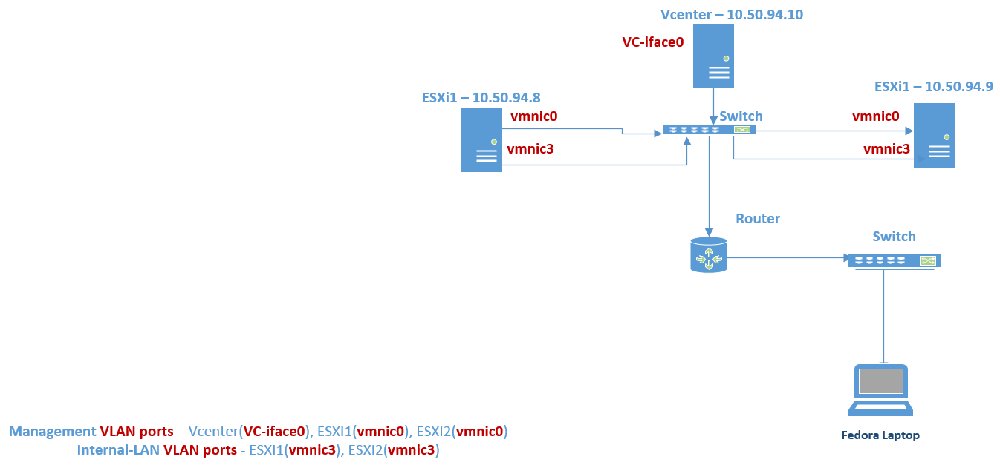
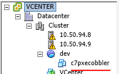
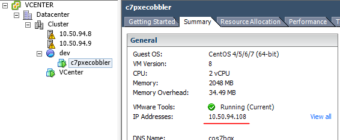
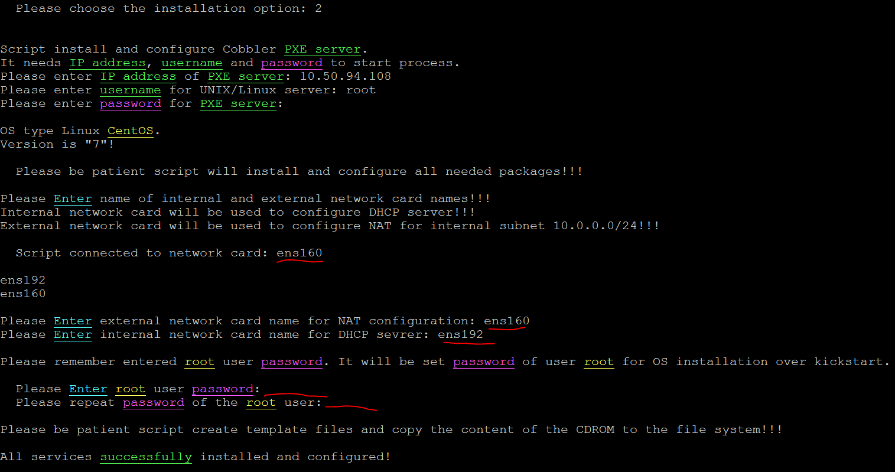
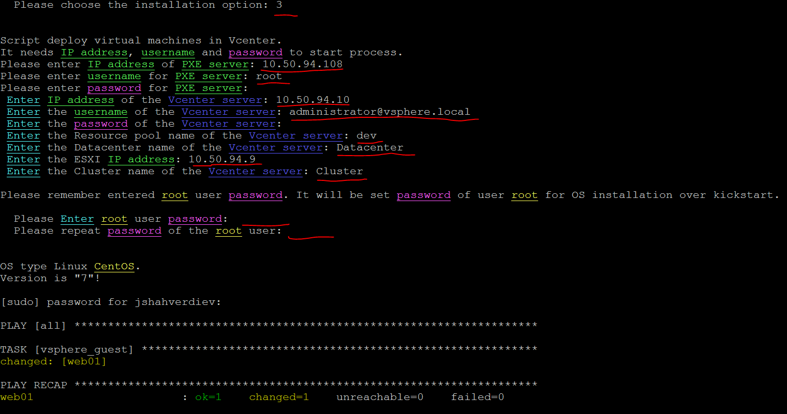
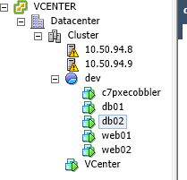

###Cobbler PXE server with Ansible Vsphere deploy virtual machines

#####This article shows us how to configure Cobbler PXE sevrer for automatic deploying Virtual Machines in our Virtual Environment(vCphere). For that I wrote script. For this script I have used Python with libraries(Jinja2, Fabric, OS, Sys etc.) and Ansible with Vsphere module. Script gives us the following menu:


#####If we choose 1 it will clone template machine for Cobbler PXE server(This will take some time). If we choose 2 it will install and configure PXE server. If we choose 3 it will deploy virtual machines with different setting which we configured before for each virtual machines. In my case I have used different static IP address. 

#####Our network Vmware topology will be as following:


#####Let start from first point. Choose 1 look at Console and vSphere client:




#####Get cloned virtual machine IP address. Login and password you must know because, you have created this. Don't forget insert CentOS7 image to virtual machine CDROM.


#####Then press 2 and input details(Login, pass etc.) for already cloned new machine to install and configure Cobbler PXE server.


#####At the end press 3 to deploy virtual machines with different setting in our ESXi's. We must input PXE credentials(IP, login, pass) and Vcenter credentials(IP, login, pass, Resource pool name, Datacenter name, Cluster name and ESXI IP).



#####And look at virtual machine console:


#####Result of our work must as following:


#####I have used this scripts in my Fedora laptop. To use this script you must install Python and needed libraries. 
```sh
# dnf install python
# python -m ensurepip
$ sudo python -m pip install -r requirement.txt
```

#####To download this codes and run use the following commands:
```sh
$ git clone https://github.com/jamalshahverdiev/c7cobblerpxe-ansible-vpshere.git
$ cd c7cobblerpxe-ansible-vpshere
$ ./run.py
```
