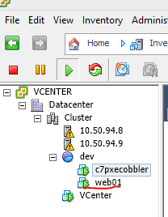
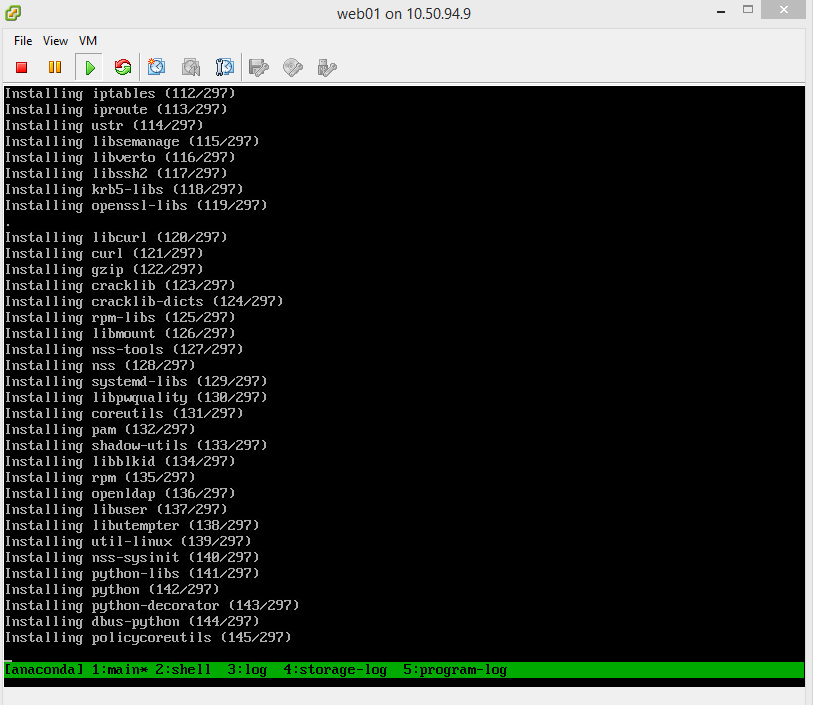

###Cobbler PXE server with Ansible Vsphere deploy virtual machines

#####This article shows us how to configure Cobbler PXE sevrer for automatic deploying Virtual Machines in our Virtual Environment(vCphere). For that I wrote script. For this script I have used Python with libraries(Jinja2, Fabric, OS, Sys etc.) and Ansible with Vsphere module. Script gives us the following menu:


#####If we choose 1 it will clone template machine for Cobbler PXE server(This will take some time). If we choose 2 it will install and configure PXE server. If we choose 3 it will deploy virtual machines with different setting which we configured before for each virtual machines. In my case I have used different static IP address. 

#####Our network Vmware topology will be as following:


#####Let start from first point. Choose 1 look at Console and vSphere client. It is requests to two files in the "ansible-pxe-create/" directory. "vm_hosts" and "vms.yml" files. "vm_hosts" file define Virtual machine hostname, Datastorename and OS ID. "vms.yml" file is define connection credentials to Vcenter, resource pool name, Cluster name and Template name from which will be cloned new Virtual machine.


#####Get cloned virtual machine IP address. Login and password you must know because, you have created this. Don't forget insert CentOS7 image to virtual machine CDROM.


#####Then press 2 and input details(Login, pass etc.) for already cloned new machine to install and configure Cobbler PXE server.


#####At the end press 3 to deploy virtual machines with different setting in our ESXi's. We must input PXE credentials(IP, login, pass) and Vcenter credentials(IP, login, pass, Resource pool name, Datacenter name, Cluster name and ESXI IP). It is will be execute "ansible-machines-create/install.py" script file. Don't forget this scripts will install and configure 4 new virtual machines and all of them will be CentOS7. But, if you want to change this to different OS then, you must create you own kickstart file and put it on Cobbler PXE server(Of course import and add new system to cobbler server too). To change to different host profile which you added in Cobbler server change "distro_name" variable in the "ansible-machines-create/install.py" file. To use different Kickstart file just change "ansible-machines-create/jinja2temps/CentOS-7.ks.j2" with your own Jinja variables. If you want use different IP addresses for your topology just change "range(2, 6)" in line "145" and set IP address for selected virtual machine in "if" lines. If you want to add more virtual machines just add names in the "virtmaes" variable in line "118".




#####And look at virtual machine console:


#####Result of our work must as following:


##### If you want to delete created virtual machines just use "delete_vms.sh" script file.

#####I have used this scripts in my Fedora laptop. To use this script you must install Python and needed libraries. 
```sh
# dnf install python
# python -m ensurepip
$ sudo python -m pip install -r requirement.txt
```

#####To download this codes and run use the following commands:
```sh
$ git clone https://github.com/jamalshahverdiev/c7cobblerpxe-ansible-vpshere.git
$ cd c7cobblerpxe-ansible-vpshere
$ ./run.py
```
